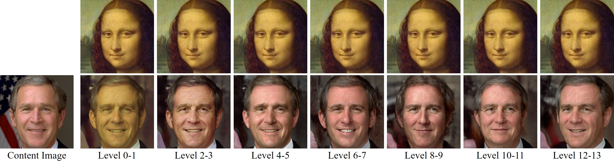

# GH-Feat - Generative Hierarchical Features from Synthesizing Images


**Figure:** *Training framework of GH-Feat.*

> **Generative Hierarchical Features from Synthesizing Images** <br>
> Yinghao Xu*, Yujun Shen*, Jiapeng Zhu, Ceyuan Yang, Bolei Zhou <br>
> *arXiv preprint arXiv:2007.10379*

[[Paper](https://arxiv.org/pdf/2007.10379.pdf)]
[[Project Page](https://genforce.github.io/ghfeat/)]

In this repository, we show that *well-trained GAN generators can be used as training supervision* to learn hierarchical and disentangled visual features. We call this feature as *Generative Hierarchical Feature (GH-Feat)*. Properly learned from a novel hierarchical encoder, *GH-Feat* is able to facilitate both discriminative and generative visual tasks, including face verification,  landmark detection,  layout prediction, transfer learning, style mixing, and image editing, *etc*. Some results are shown as follows.

## Discriminative Tasks

Indoor scene layout prediction


Facial landmark detection


Face verification (face reconstruction)


## Generative Tasks

Image harmonization


Global editing


Local Editing


Multi-level style mixing


## BibTeX

```bibtex
@article{xu2020generative,
  title   = {Generative Hierarchical Features from Synthesizing Images},
  author  = {Xu, Yinghao and Shen, Yujun and Zhu, Jiapeng and Yang, Ceyuan and Zhou, Bolei},
  journal = {arXiv preprint arXiv:2007.10379},
  year    = {2020}
}
```

## Code Coming Soon
